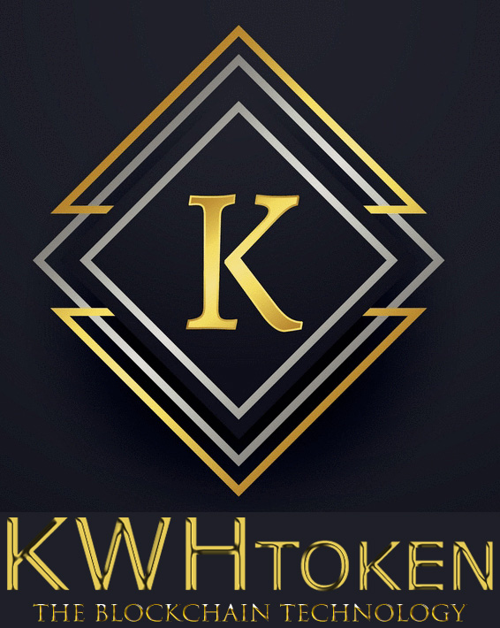

# KWHToken (KWHT)

### Currently in Pre-ICO A Phase

## The First Blockchain Solution for the Global Energy Market

KWHToken uses the peer-to-peer technology to manage anonymous transactions and to operate with no central authority or banks. KWHToken is open-source, nobody owns or controls KWHToken and everyone can take part. Through many of its unique properties, it allows exciting uses within the Energy Market Industry that could not be converted by any previous payment systems.

 

**General Overview**

Token Name|KWHToken (KWHT)
---|---
Decimals|18
Smallest Unit (etron)|1e-18 KWHT
Token Amount|Limited to 900,000 KWHT
Token Price|Fixed to 1 KWHT / 0.005 ETH (Presale)
Percentage for sale|70%
Minimum Token Purchase|0.05 ETH
Maximum Token Purchase|No Limit
Minimum Funding Goal|None

 

**Purchase your KWHToken (Currently in Pre-ICO A Phase)**

The maximum token amount is limited to 900k KWHTs.

1. Send ETH to the ICO-Address:
**0x0e0192db4dcC2A7E34FFa19EDdaf479f9B9b28C7**
2. Once your ETH is received and verified, Token distribution will be within 24 hours after purchase to your sending address.
3. Accepted currency is only ETH (Ethereum).

 

**ICO Phases**

The token sale goes through the following phases:

1. **Pre-ICO A Phase:** 5mETH / KWHT (for the first 200.000 KWHTs)
2. **Pre-ICO B Phase:** 7mETH / KWHT (up to 400.000 KWHTs)
3. **Regular ICO Phase:** 9mETH / KWHT (up to 700.000 KWHTs)
4. **Listing on exchanges**
5. **Buyback of 100.000 KWHTs by kwhcoin.io**

 

See Website for further informations:
http://www.kwhcoin.io
